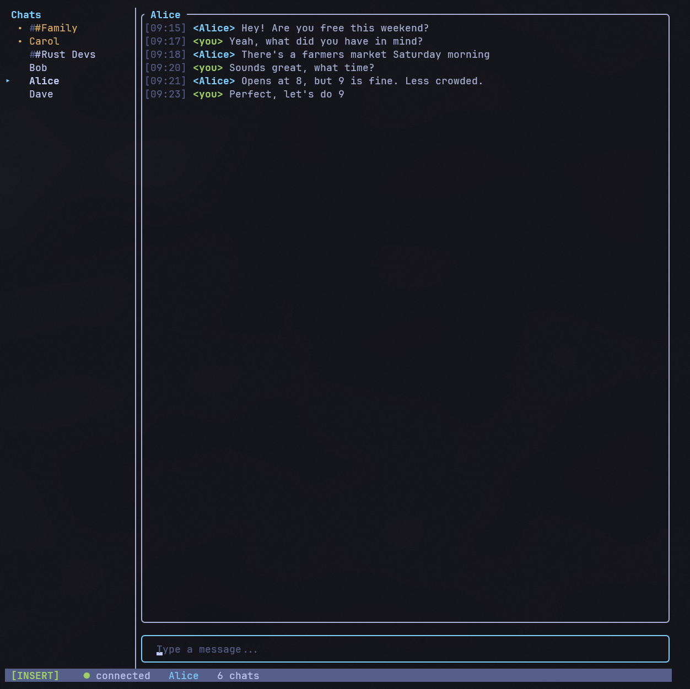

# signal-tui

A terminal-based Signal client with an IRC aesthetic. Wraps [signal-cli](https://github.com/AsamK/signal-cli) via JSON-RPC for the messaging backend.



## Prerequisites

- [signal-cli](https://github.com/AsamK/signal-cli) installed and registered/linked to a Signal account
- Rust toolchain (1.70+)

## Building

```sh
cargo build --release
```

## Usage

```sh
# Use account from config file
signal-tui

# Specify account on command line
signal-tui -a +15551234567

# Custom config path
signal-tui -c /path/to/config.toml
```

## Configuration

Config is loaded from:
- Linux/macOS: `~/.config/signal-tui/config.toml`
- Windows: `%APPDATA%\signal-tui\config.toml`

```toml
account = "+15551234567"
signal_cli_path = "signal-cli"
download_dir = "/home/user/signal-downloads"
```

All fields are optional. `signal_cli_path` defaults to `"signal-cli"` (found via PATH), and `download_dir` defaults to `~/signal-downloads/`. On Windows, use the full path to `signal-cli.bat` if it isn't in your PATH.

## Features

- Send and receive messages (1:1 and group)
- Receive file attachments (displayed inline as `[attachment: filename]`)
- Typing indicators with contact name resolution
- Outgoing message sync (messages sent from your phone appear in the TUI)
- SQLite message persistence across sessions (WAL mode)
- Unread counts with persistent read markers
- Contact name resolution from Signal address book
- Groups auto-populated in sidebar on startup
- First-run setup wizard with QR code device linking
- Vim-style modal editing (Normal/Insert modes)
- Responsive layout with resizable, auto-hiding sidebar

## Commands

| Command | Alias | Description |
|---|---|---|
| `/join <name>` | `/j` | Switch to a conversation by contact name, number, or group name |
| `/part` | `/p` | Leave current conversation (return to no selection) |
| `/sidebar` | `/sb` | Toggle sidebar visibility |
| `/quit` | `/q` | Exit signal-tui |
| `/help` | `/h` | Show help text in the current conversation |

To message a new contact, use `/join +15551234567` with their phone number in E.164 format.

## Keyboard Shortcuts

The app uses vim-style modal editing with two modes: **Insert** (default) and **Normal**.

### Global (both modes)

| Key | Action |
|---|---|
| `Ctrl+C` | Quit |
| `Tab` | Next conversation |
| `Shift+Tab` | Previous conversation |
| `PgUp` / `PgDn` | Scroll messages (5 lines) |
| `Ctrl+Left` / `Ctrl+Right` | Resize sidebar |

### Normal mode

Enter Normal mode by pressing `Esc` in Insert mode.

| Key | Action |
|---|---|
| `j` / `k` | Scroll down/up 1 line |
| `Ctrl+D` / `Ctrl+U` | Scroll down/up half page |
| `g` / `G` | Scroll to top/bottom |
| `h` / `l` | Move cursor left/right |
| `w` / `b` | Move cursor forward/back one word |
| `0` / `$` | Move cursor to start/end of line |
| `x` | Delete character at cursor |
| `D` | Delete from cursor to end of line |
| `i` | Enter Insert mode |
| `a` | Enter Insert mode (cursor right 1) |
| `I` / `A` | Enter Insert mode at start/end of line |
| `o` | Enter Insert mode (clear buffer) |
| `/` | Enter Insert mode with `/` pre-typed |
| `Esc` | Clear input buffer |

### Insert mode (default)

| Key | Action |
|---|---|
| `Esc` | Switch to Normal mode |
| `Enter` | Send message / execute command |
| `Backspace` / `Delete` | Delete characters |
| `Left` / `Right` | Move cursor |
| `Home` / `End` | Jump to start/end of line |

## Architecture

```
┌──────────┐   mpsc channels   ┌──────────────┐
│  TUI     │ <───────────────> │  Signal      │
│  (main   │   SignalEvent     │  Backend     │
│  thread) │   UserCommand     │  (tokio task)│
└──────────┘                   └──────┬───────┘
                                      │
                               stdin/stdout
                                      │
                               ┌──────▼───────┐
                               │  signal-cli  │
                               │  (child proc)│
                               └──────────────┘
```

## License

MIT
