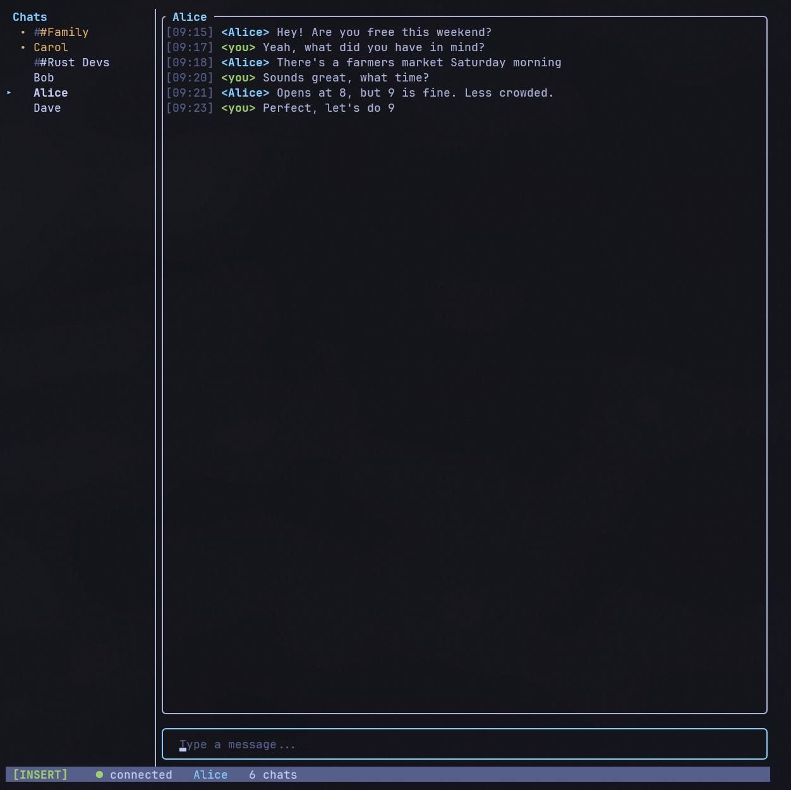

<p align="center">
  
</p>

<p align="center">
  <a href="https://github.com/johnsideserf/siggy/actions/workflows/ci.yml"></a>
  <a href="https://github.com/johnsideserf/siggy/releases/latest"></a>
  <a href="LICENSE"></a>
  <a href="https://crates.io/crates/siggy"></a>
  <a href="https://johnsideserf.github.io/siggy/"></a>
  <a href="https://ko-fi.com/johnsideserf"></a>
  <a href="https://x.com/siggyapp"></a>
</p>

A terminal-based Signal messenger client with an IRC aesthetic. Wraps [signal-cli](https://github.com/AsamK/signal-cli) via JSON-RPC for the messaging backend.



## Install

### Homebrew (macOS)

```sh
brew tap johnsideserf/siggy
brew install siggy
```

### Pre-built binaries

Download the latest release for your platform from [Releases](https://github.com/johnsideserf/siggy/releases).

**Linux / macOS** (one-liner):

```sh
curl -fsSL https://raw.githubusercontent.com/johnsideserf/siggy/master/install.sh | bash
```

**Windows** (PowerShell):

```powershell
irm https://raw.githubusercontent.com/johnsideserf/siggy/master/install.ps1 | iex
```

Both scripts download the latest release binary and check for signal-cli.

### From crates.io

Requires Rust 1.70+.

```sh
cargo install siggy
```

### Build from source

Or clone and build locally:

```sh
git clone https://github.com/johnsideserf/siggy.git
cd siggy
cargo build --release
# Binary is at target/release/siggy
```

## Prerequisites

- [signal-cli](https://github.com/AsamK/signal-cli) installed and accessible on PATH (or configured via `signal_cli_path`)
- A Signal account linked as a secondary device (the setup wizard handles this)

## Usage

```sh
siggy                        # Launch (uses config file)
siggy -a +15551234567        # Specify account
siggy -c /path/to/config.toml  # Custom config path
siggy --setup                # Re-run first-time setup wizard
siggy --demo                 # Launch with dummy data (no signal-cli needed)
siggy --incognito            # No local message storage (in-memory only)
```

On first launch, the setup wizard guides you through locating signal-cli, entering your phone number, and linking your device via QR code.

## Configuration

Config is loaded from:
- **Linux/macOS:** `~/.config/siggy/config.toml`
- **Windows:** `%APPDATA%\siggy\config.toml`

```toml
account = "+15551234567"
signal_cli_path = "signal-cli"
download_dir = "/home/user/signal-downloads"
notify_direct = true
notify_group = true
desktop_notifications = false
inline_images = true
mouse_enabled = true
send_read_receipts = true
theme = "Default"
proxy = ""
```

All fields are optional. `signal_cli_path` defaults to `"signal-cli"` (found via PATH), and `download_dir` defaults to `~/signal-downloads/`. On Windows, use the full path to `signal-cli.bat` if it isn't in your PATH.

## Features

- **Messaging** -- Send and receive 1:1 and group messages
- **Attachments** -- Image previews rendered inline as halfblock art; non-image attachments shown as `[attachment: filename]`
- **Clickable links** -- URLs and file paths are OSC 8 hyperlinks (clickable in terminals like Windows Terminal, iTerm2, etc.)
- **Typing indicators** -- Shows who is typing with contact name resolution
- **Message sync** -- Messages sent from your phone appear in the TUI
- **Persistence** -- SQLite message storage with WAL mode; conversations and read markers survive restarts
- **Unread tracking** -- Unread counts in sidebar with "new messages" separator in chat
- **Notifications** -- Terminal bell on new messages (configurable per direct/group, per-chat mute) and OS-level desktop notifications
- **Contact resolution** -- Names from your Signal address book; groups auto-populated on startup
- **Message reactions** -- React with `r` in Normal mode; emoji picker with badge display (`👍 2 ❤️ 1`)
- **Reply / quote** -- Press `q` on a focused message to reply with quoted context
- **Edit messages** -- Press `e` to edit your own sent messages
- **Delete messages** -- Press `d` to delete locally or remotely (for your own messages)
- **Message search** -- `/search <query>` with `n`/`N` to jump between results
- **@mentions** -- Type `@` in group chats to mention members with autocomplete
- **Message selection** -- Focused message highlight when scrolling; `J`/`K` to jump between messages
- **Read receipts** -- Status symbols on outgoing messages (Sending → Sent → Delivered → Read → Viewed)
- **Disappearing messages** -- Honors Signal's disappearing message timers; set per-conversation with `/disappearing`
- **Group management** -- Create groups, add/remove members, rename, leave via `/group`
- **Message requests** -- Accept or delete messages from unknown senders
- **Block / unblock** -- Block contacts or groups with `/block` and `/unblock`
- **Mouse support** -- Click sidebar conversations, scroll messages, click to position cursor
- **Color themes** -- Selectable themes via `/theme` or `/settings`
- **Setup wizard** -- First-run onboarding with QR code device linking
- **Vim keybindings** -- Modal editing (Normal/Insert) with full cursor movement
- **Command autocomplete** -- Tab-completion popup for slash commands
- **Settings overlay** -- Toggle notifications, sidebar, inline images from within the app
- **Responsive layout** -- Resizable sidebar that auto-hides on narrow terminals (<60 columns)
- **Incognito mode** -- `--incognito` uses in-memory storage; nothing persists after exit
- **Proxy support** -- Configure a Signal TLS proxy via the `proxy` config field for use in restricted networks
- **Demo mode** -- Try the UI without signal-cli (`--demo`)

## Commands

| Command | Alias | Description |
|---|---|---|
| `/join <name>` | `/j` | Switch to a conversation by contact name, number, or group |
| `/part` | `/p` | Leave current conversation |
| `/attach` | `/a` | Open file browser to attach a file |
| `/search <query>` | `/s` | Search messages in current (or all) conversations |
| `/sidebar` | `/sb` | Toggle sidebar visibility |
| `/bell [type]` | `/notify` | Toggle notifications (`direct`, `group`, or both) |
| `/mute [dur]` | | Mute/unmute current conversation (optional: 1h, 8h, 1d, 1w) |
| `/block` | | Block current contact or group |
| `/unblock` | | Unblock current contact or group |
| `/disappearing <dur>` | `/dm` | Set disappearing message timer (`off`, `30s`, `5m`, `1h`, `1d`, `1w`) |
| `/group` | `/g` | Open group management menu |
| `/theme` | `/t` | Open theme picker |
| `/contacts` | `/c` | Browse synced contacts |
| `/settings` | | Open settings overlay |
| `/help` | `/h` | Show help overlay |
| `/quit` | `/q` | Exit siggy |

Type `/` to open the autocomplete popup. Use `Tab` to complete, arrow keys to navigate.

To message a new contact: `/join +15551234567` (E.164 format).

## Keyboard Shortcuts

The app uses vim-style modal editing with two modes: **Insert** (default) and **Normal**.

### Global (both modes)

| Key | Action |
|---|---|
| `Ctrl+C` | Quit |
| `Tab` / `Shift+Tab` | Next / previous conversation |
| `PgUp` / `PgDn` | Scroll messages (5 lines) |
| `Ctrl+Left` / `Ctrl+Right` | Resize sidebar |

### Normal mode

Press `Esc` to enter Normal mode.

| Key | Action |
|---|---|
| `j` / `k` | Scroll down / up 1 line |
| `J` / `K` | Jump to previous / next message |
| `Ctrl+D` / `Ctrl+U` | Scroll down / up half page |
| `g` / `G` | Scroll to top / bottom |
| `h` / `l` | Move cursor left / right |
| `w` / `b` | Word forward / back |
| `0` / `$` | Start / end of line |
| `x` | Delete character at cursor |
| `D` | Delete from cursor to end |
| `y` / `Y` | Copy message body / full line |
| `r` | React to focused message |
| `q` | Reply / quote focused message |
| `e` | Edit own sent message |
| `d` | Delete message (local or remote) |
| `n` / `N` | Jump to next / previous search match |
| `i` | Enter Insert mode |
| `a` | Enter Insert mode (cursor right 1) |
| `I` / `A` | Enter Insert mode at start / end of line |
| `o` | Enter Insert mode (clear buffer) |
| `/` | Enter Insert mode with `/` pre-typed |

### Insert mode (default)

| Key | Action |
|---|---|
| `Esc` | Switch to Normal mode |
| `Enter` | Send message / execute command |
| `Backspace` / `Delete` | Delete characters |
| `Up` / `Down` | Recall input history |
| `Left` / `Right` | Move cursor |
| `Home` / `End` | Jump to start / end of line |

## Architecture

```
Keyboard --> InputAction --> App state --> SignalClient (mpsc) --> signal-cli (JSON-RPC stdin/stdout)
signal-cli --> JsonRpcResponse --> SignalEvent (mpsc) --> App state --> SQLite + Ratatui render
```

```
+------------+   mpsc channels   +----------------+
|  TUI       | <---------------> |  Signal        |
|  (main     |   SignalEvent     |  Backend       |
|  thread)   |   UserCommand     |  (tokio task)  |
+------------+                   +--------+-------+
                                          |
                                   stdin/stdout
                                          |
                                 +--------v-------+
                                 |  signal-cli    |
                                 |  (child proc)  |
                                 +----------------+
```

Built with [Ratatui](https://ratatui.rs/) + [Crossterm](https://github.com/crossterm-rs/crossterm) on a [Tokio](https://tokio.rs/) async runtime.

## License

[GPL-3.0](LICENSE)
